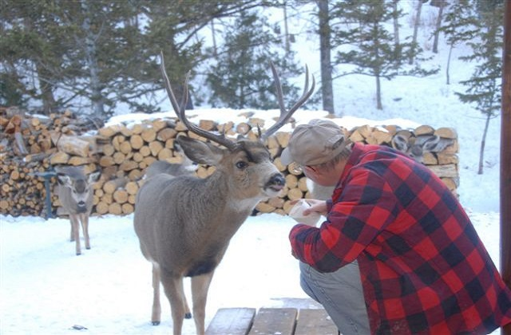

h1 Тестовое задание для SolidOpinion
====================================

h2 1) Изменить текст заголовка и изменить шрифт через @font-face:

```css
/* Replace fonts */

@font-face {
    font-family: "Open Sans";
    src: url("../fonts/OpenSans-Regular.ttf") format("truetype");
}

/* END REPLCE */
```

```html
<h1 class="hero-heading flex-media-heading heading-larger heading-largest-for-medium-up text-tighter block-normal">
  What to do after retirement?
</h1>
```
#####################################

h2 2) Вместо изображения вставить карусель из пяти изображений. Изображения в карусели должны
соответствовать тематике статьи и иметь размер картинки в самой статье. Стиль карусели
произвольный.

```html
<!-- Carousel Slider -->

<div id="carouselSlider">
    <div>
        
    </div>
    <div>
        
    </div>
    <div>
        
    </div>
    <div>
        
    </div>
    <div>
        
    </div>
</div>

<script>
    $('#carouselSlider').slick({
        speed: 300,
        autoplay: true,
        autoplaySpeed: 5000,
        arrows: false
    });
</script>

<!-- END of Carousel Slider -->
```

#####################################